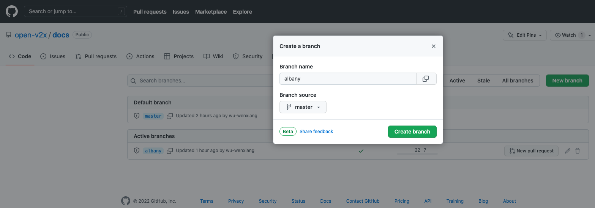
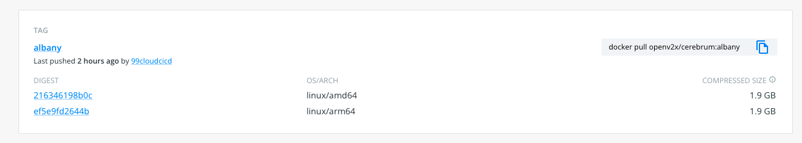
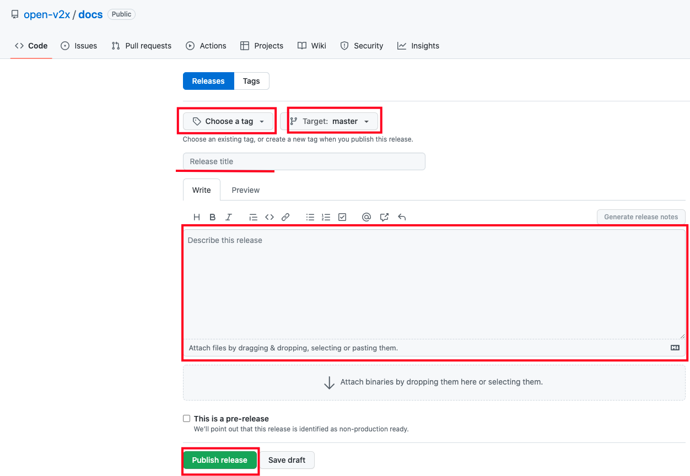
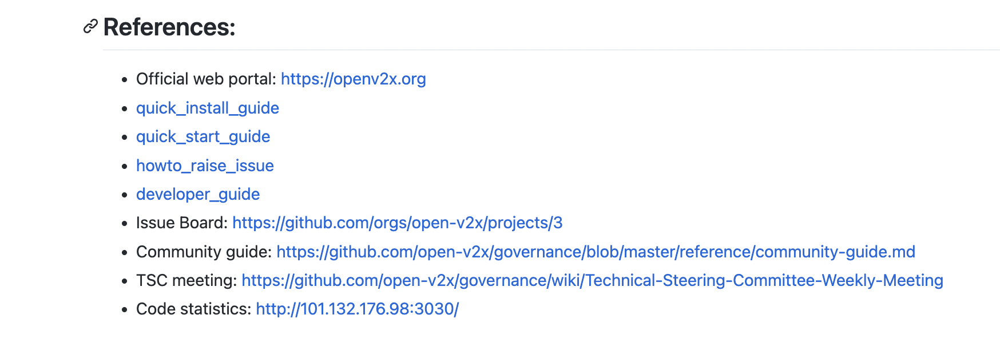

# OpenV2x 发布流程

涉及 REPOS:

- [cerebrum](https://github.com/open-v2x/cerebrum)
- [docs](https://github.com/open-v2x/docs)
- [dandelion](https://github.com/open-v2x/dandelion)
- ~~[edgeview](https://github.com/open-v2x/edgeview)~~
- [roadmocker](https://github.com/open-v2x/roadmocker)
- ~~[centerview](https://github.com/open-v2x/centerview)~~
- [hippocampus](https://github.com/open-v2x/hippocampus)
- [lidar](https://github.com/open-v2x/lidar)

## 1. 创建分支

以 open-v2x/docs 为例:



- `Branch name` 为新分支名称
- `Branch source` 为现有分支，以现有分支为基础拉取分支
- 注意:
  - 拉取分支需要有该项目的相应权限
  - 新分支名，可以参考 openstack 的命名规则，如"stable/wallaby"

## 2. 提交切换分支变更代码

## 2.1 搭建 CD 基础环境

### 2.1.1 通用步骤

1. config sshd
2. copy test.mp4 to `/openv2x/videos/` for rtsp stream simulator
3. set env in `/etc/environment`, `export OPENV2X_EXTERNAL_IP=...`
4. docker pull hippocampus-base & cerebrum-base for cache
5. [option] crontab setting

### 2.1.2 Ubuntu 22.04

安装 docker-compose

```bash
apt-get install docker.io docker-compose
```

sh 指向 bash

```console
root@openv2x-cicd:~/src# dpkg-reconfigure dash
Removing 'diversion of /bin/sh to /bin/sh.distrib by dash'
Adding 'diversion of /bin/sh to /bin/sh.distrib by bash'
Removing 'diversion of /usr/share/man/man1/sh.1.gz to /usr/share/man/man1/sh.distrib.1.gz by dash'
Adding 'diversion of /usr/share/man/man1/sh.1.gz to /usr/share/man/man1/sh.distrib.1.gz by bash'

# 选否

root@openv2x-cicd:~/src# ls -al /usr/bin/sh
lrwxrwxrwx 1 root root 4 Jun 27 16:26 /usr/bin/sh -> bash
```

### 2.1.3 CentOS 7.9 2009

1. upgrade kernel to 5.4+
2. install docker.io & docker-compose 20.10

## 2.2 提交代码到新分支

拉取各项目新分支代码，修改分支和 tag 名，再提交到新分支上

参考提交:

- https://github.com/open-v2x/cerebrum/commit/179bed8c7cf6af3095e35102d4aa1abc9fcd3d7e
- https://github.com/open-v2x/docs/commit/651199f11f0a6a77f3c755d61f2db6d7e05fae94
- https://github.com/open-v2x/dandelion/commit/d96bfd9e47e93df90d658d1ab65b62ca3c94c598
- ~~https://github.com/open-v2x/edgeview/commit/adb90fec3b62da1205701e2786c42ee1faad0072~~
- ~~https://github.com/open-v2x/centerview/commit/bb13814222057e5a6889d7da7dd88d6f556a519e~~
- https://github.com/open-v2x/roadmocker/commit/f3341f2f263f2d5030049265504c14712391b1b1
- https://github.com/open-v2x/lidar/commit/cd82fcd6dedb1486f9a50515c270e66f06990360
- https://github.com/open-v2x/hippocampus/commit/a50c26d5186c5334f060139199a5dbf8a964deb5

注意事项:

- `.drone.yml` 里面的一些分支和 tag 名，要和新分支名保持一致
- `.github/workflows/` 下 的一些 CI 文件，里面的分支和 tag 名，要和新分支名保持一致
- `.github/workflows/` 下 的一些 CI 文件，里面的密钥 secrets ，保持和 albany 一致,不新增变量
- `.md` 结尾的文件，可以搜索一下，有没有按照分支名和 tag 名定义的地方，也需要和新分支保持一致
- `open-v2x/docs` 项目里面，还需要修改`install.sh`脚本和 depoly 文件夹下的 `yaml` 文件，以及
  `.github/workflows/package.yml` 文件
- 举例，新分支名为 beihai ,已有分支名为 master 和 albany，需要全局搜索 master/albany/latest，看下是否需要替换成新分支名 beihai
- 修改 cerebrum 仓库的 tag 时，需要强行合并 commit。因为跑 workflow 里的测试用例，是以 aio 的方式部署 cerebrum，但是 aio
  部署用到新版本的镜像还没有推上去，测试用例会失败。可以参考 <https://github.com/open-v2x/cerebrum/pull/167>
- 修改 docs 仓库下的 src/install.sh 时，cerebrum 和 hippocampus 的 base 是用来加速的，镜像标签不需要改成新版本，保持 latest 即可。参考:
  - <https://github.com/open-v2x/docs/commit/e47f3cede6cae9d366190105ef16a3f2720dd97e>
  - <https://github.com/open-v2x/docs/commit/e66b3c00acfef4b3a69d0c0c078d6f5bdc5f36b2>

## 2.3 更改镜像标签

更改标签名称为 beihai-1.2.0.commit-id ，2 表示 beihai 版本，0 表示 beihai 版本的第一次发布，commit-id 是 github 各个仓库中 beihai
的最后一次提交的 commit id ,取前 7 位。下一次 beihai 发布的版本号应该是 beihai-1.2.1.commit-id。

```shell
docker_tag() {
 images=(
  "dandelion"
  "edgeview"
  "centerview"
  "cerebrum"
  "hippocampus"
  "lidar"
  "roadmocker"
  )
  registry=registry.cn-shanghai.aliyuncs.com # docker.io
  for i in ${images[@]}; do
    git clone git@github.com:open-v2x/${i}.git
    cd ${i} || true
    git checkout beihai
    get_commit_id=`git log -1 --pretty=format:%h`
    tag="beihai-1.2.0.${get_commit_id}"
    echo ${tag}
    cd -
    rm -rf ${i}
    docker pull ${registry}/openv2x/${i}:beihai
    docker tag ${registry}/openv2x/${i}:beihai ${registry}/openv2x/${i}:${tag}
    docker push ${registry}/openv2x/${i}:${tag}
    if [[ ${i} == hippocampus ]]
    then
      docker pull ${registry}/openv2x/rtsp_simulator:beihai
      docker tag ${registry}/openv2x/rtsp_simulator:beihai ${registry}/openv2x/rtsp_simulator:${tag}
      docker push ${registry}/openv2x/rtsp_simulator:${tag}
    fi
    docker rmi ${registry}/openv2x/${i}:beihai
  done
}

docker_tag
```

## 3. 部署测试

### 3.1 部署

等待变更代码合并之后，观察 [Dockerhub](https://hub.docker.com/u/openv2x) 镜像仓库中是否有新分支镜像生成（镜像由 CI 自动 build 和 push）



待镜像上传完成之后，根据 `open-v2x/docs` 项目新分支下的部署文档，进行安装部署

### 3.2 测试

测试过程略

## 4. 版本发布

## 4.1 Release Note

> 参考: https://github.com/open-v2x/docs/releases/tag/albany-1.0.126 或者
> https://github.com/open-v2x/docs/releases/tag/beihai-1.2.0

基本包含:

- Release Version: 发布的版本，如:"albany","beihai"
- Release Date: 发布的日期，格式参考:"July 29, 2022"
- Feature List: 功能列表，可以对比上次发版时的提交记录，列出新增功能
- Bug Fix: 缺陷修复，同样可以对比上次发版的提交记录，列出新修复的缺陷问题
- Known Issue: 指的是未解决问题列表，需要提交 issue 到对应项目下

## 4.2 tag 命名规则

> 参考 beihai-1.2.0

2 表示 beihai 版本，0 表示 beihai 版本的第一次发布，下一次 beihai 发布的版本号应该是 beihai-1.2.1。

## 4.3 发布

到 `open-v2x/docs` 项目下点击 [Releases](https://github.com/open-v2x/docs/releases) 到 release 列表，新建一个
release



1. tag: 选择一个已经存在的 tag ，或者根据新的分支创建一个新的 tag
2. release title: 填写标题，简易扼要
3. release note: 将 release note 全部写入，注意 markdown 格式
4. publish: 发布版本，也可以保存到草稿，后续修改完再发版

## 4.4 宣传新版本（以 beihai 为例）

### 4.4.1 官网发文章

https://openv2x.org/news/2022-11-18-1/

## 4.5 文档整理

### 4.5.1 修改 openv2x References 链接

将 albany 相关的链接修改为新分支 beihai 的相关链接

地址: https://github.com/open-v2x/.github/blob/master/profile/README.md

参考提交 https://github.com/open-v2x/.github/commit/46d488ffac725ca157cc15c5ee6f23ad895a3b94



### 4.5.2 更新快速安装手册

如果部署方法有变更或者补充，需要更新对应版本的[部署手册](https://github.com/open-v2x/docs/blob/beihai/docs/v2x-quick-install.md)

参考提交 https://github.com/open-v2x/docs/commit/deb6a6e24cd8b3571eb028c076654eebc4a135de

### 4.5.3 更新用户手册

如果功能有新增，需要更新对应版本的[用户手册](https://github.com/open-v2x/docs/blob/beihai/docs/v2x-user-manual.md)

参考提交 https://github.com/open-v2x/docs/commit/657cd642601f7defee43dc4cb46535517d525db3
